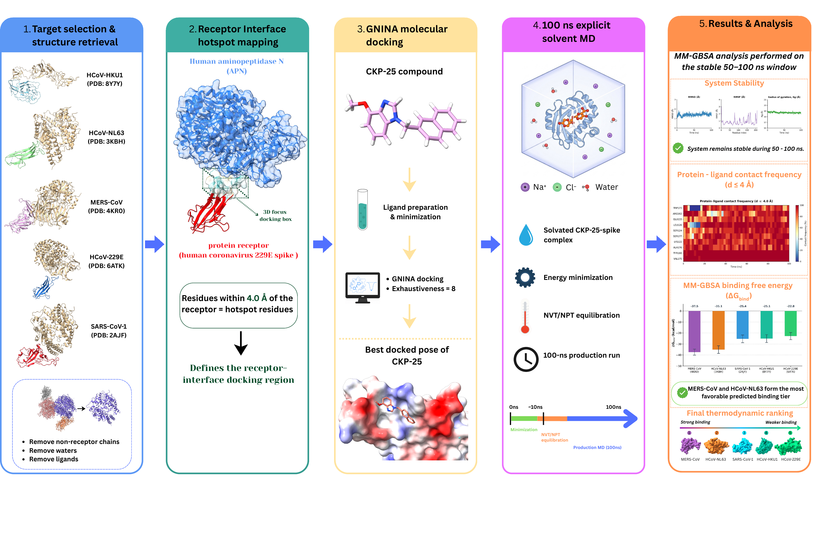

# CKP-25 Broad-Spectrum Coronavirus Spike MD Workflow

Computational companion repository for the manuscript:

**Targeting Diverse Human Coronaviruses with a Single Small Molecule: Computational Assessment of CKP-25 as a Promising Broad-Spectrum Receptor-Binding Anchor**

This repository contains the curated spike-protein inputs, CKP-25 docking poses, GROMACS molecular dynamics pipeline, MM-GBSA workflow, and analysis scripts used to generate the figures and tables in the paper.

## Workflow



High-resolution PDF: [`images/workflow.pdf`](images/workflow.pdf)

## Repository Layout

```text
.
├── Data/                         # Curated paper inputs: spike PDBs + CKP-25 docked poses
├── images/                       # Workflow figure for GitHub
├── gromacs_files/                # Core GROMACS preparation, simulation, analysis, viewer code
├── scripts/                      # Paper-level wrappers for all five systems
├── environment.yml               # Conda environment for reproducible runs
├── mmpbsa.in                     # AmberTools MM-GBSA input
└── *_metrics / plot / heatmap scripts
```

Legacy OpenMM files and raw exploratory docking folders are intentionally ignored by Git. The public workflow is the GROMACS-based workflow described in the manuscript.

## Input Systems

| System | Virus | PDB | Spike chain | Starting files |
|---|---|---:|:---:|---|
| MERS | MERS-CoV | 4KR0 | B | `Data/proteins/MERS_4KR0_B_spike.pdb`, `Data/docked_poses/MERS_CKP25_top_pose.sdf` |
| SARS1 | SARS-CoV-1 | 2AJF | E | `Data/proteins/SARS1_2AJF_E_spike.pdb`, `Data/docked_poses/SARS1_CKP25_top_pose.sdf` |
| NL63 | HCoV-NL63 | 3KBH | E | `Data/proteins/NL63_3KBH_E_spike.pdb`, `Data/docked_poses/NL63_CKP25_top_pose.sdf` |
| 229E | HCoV-229E | 6ATK | E | `Data/proteins/229E_6ATK_E_spike.pdb`, `Data/docked_poses/229E_CKP25_top_pose.sdf` |
| HKU1 | HCoV-HKU1 | 8Y7Y | A | `Data/proteins/HKU1_8Y7Y_A_spike.pdb`, `Data/docked_poses/HKU1_CKP25_top_pose.sdf` |

Machine-readable mapping: [`Data/metadata.tsv`](Data/metadata.tsv)

## Installation

Create and activate the Conda environment:

```bash
conda env create -f environment.yml
conda activate gromacs_md
```

Check that GROMACS is available:

```bash
gmx --version
```

The environment installs GROMACS, ACPYPE, AmberTools, PDBFixer/OpenMM, RDKit, MDTraj, ParmEd, NumPy, Matplotlib, and tqdm.

## Run One System

Use this as a smoke test before launching all 100 ns simulations:

```bash
bash gromacs_files/run_MD_gromacs.sh \
  Data/proteins/MERS_4KR0_B_spike.pdb \
  Data/docked_poses/MERS_CKP25_top_pose.sdf \
  1 \
  runs/MERS_demo_1ns
```

The runner performs:

1. Protein cleanup with PDBFixer.
2. Protein topology with `amber99sb-ildn` and TIP3P water.
3. Ligand parametrization with ACPYPE/GAFF2 and AM1-BCC charges.
4. Dodecahedral solvation box and 0.15 M NaCl.
5. Energy minimization, 100 ps NVT, 100 ps NPT, production MD.
6. RMSD, RMSF, radius of gyration, contact plots, and an offline HTML trajectory viewer.

## Reproduce the Five Paper MD Runs

```bash
bash scripts/run_all_md.sh 100 runs
```

Outputs are written to `runs/` and are ignored by Git because trajectory and topology files are large.

## Generate MD Analysis Figures

```bash
bash scripts/run_all_analysis.sh runs paper_figures 100
```

This generates:

- Per-system plots: H-bonds/polar contacts, protein and ligand RMSD, RMSF, Rg.
- Offline 3D trajectory viewers in each run folder.
- `paper_figures/md_metrics_summary.md`
- `paper_figures/*_metrics.png`
- `paper_figures/md_rmsf_rg_stability.jpg`
- `paper_figures/md_polar_contacts_stability.jpg`
- `paper_figures/md_contact_heatmap_4panel.jpg`
- `paper_figures/md_contact_heatmap_5panel.jpg`

## Run MM-GBSA

Prepare Amber-compatible topology and trajectory files:

```bash
bash scripts/prepare_mmpbsa_inputs.sh runs
```

Run MM-GBSA with AmberTools:

```bash
bash scripts/run_mmpbsa_all.sh runs
```

Plot the MM-GBSA binding free-energy summary:

```bash
python plot_mmpbsa_bar.py --results-dir runs --out-dir paper_figures
```

## Simulation Settings Encoded in the Pipeline

| Step | Setting |
|---|---|
| Protein force field | AMBER99SB-ILDN |
| Ligand force field | GAFF2 via ACPYPE |
| Ligand charges | AM1-BCC |
| Water model | TIP3P (`spc216.gro`) |
| Salt | 0.15 M NaCl, neutralized |
| Box | Dodecahedron, 1.2 nm margin |
| Energy minimization | Steepest descent, 50,000 steps |
| NVT | 100 ps, V-rescale thermostat, 300 K |
| NPT | 100 ps, V-rescale thermostat, Parrinello-Rahman barostat, 1 bar |
| Production | 2 fs timestep, PME electrostatics, 100 ns for manuscript runs |
| MM-GBSA | AmberTools `MMPBSA.py`, GB model `igb=2`, 0.150 M salt |

## License

This project is licensed under the MIT License. See [`LICENSE`](LICENSE) for details.

## Citation

Citation coming soon. The full manuscript citation will be added here after publication.

## Notes for GitHub

The `.gitignore` keeps generated MD outputs, MM-GBSA intermediates, raw exploratory folders, the old OpenMM attempt, and manuscript drafting files out of the public repository. The committed pieces should be the curated inputs, workflow figure, GROMACS pipeline, analysis scripts, and environment definition.
